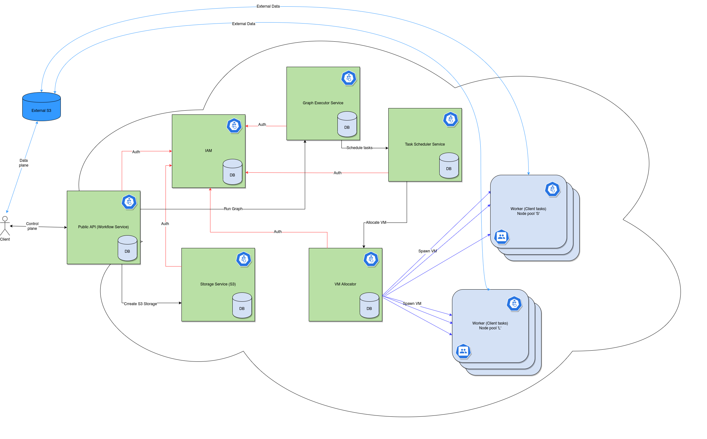
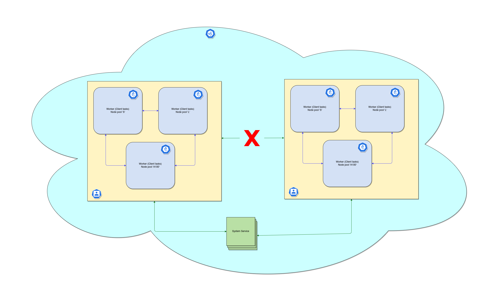

# Верхнеуровневое описание архитектуры Lzy

Lzy состоит из системных сервисов (отмечены зелёным цветом) и сервисов, исполняющих пользовательский код
(отмечены синим цветом).

## Системные сервисы Lzy

### Public Api (Workflow Service)
Это точка входа в Lzy для пользователей. Через этот сервис происходит управление всеми вычислениями пользователей:
* управление временем жизни workflow;
* запуск новых графов исполнения;
* получение статуса исполнения;
* получение результатов (ссылка на внешнее хранилище).

### IAM (Identity and Access Management)
Сервис отвечает за управлением жизненным циклом учетных записей и доступами к различным ресурсам.

### Storage Service
У пользователя при запуске вычислений есть возможность либо указать своё собственное S3-хранилище для результатов
промежуточных вычислений либо запросить такое у системы.

В первом случае пользователь сам управляет его временем жизни и размером.

Во втором случае Lzy через `Storage`-сервис создаёт временный S3-bucket с какими-то ограничениями на время жизни и
размер. Вычисление может быть прервано, если в этом хранилище закончится место.

### Graph Executor Service
Сервис отвечает за исполнение графа вычислений. Получая на вход граф операций и связей между ними, сервис
вычисляет очерёдность запусков операций и следит за общим прогрессом.

### Scheduler Service
Построив очерёдность исполнения операций, `Graph Executor` отправляет их (это могут быть как отдельные операции,
так группы операций) в `Scheduler`, который уже запустит их на worker'ах.

### VM Allocator Service
Через этот сервис происходит выделение VM-ок для пользовательских вычислений. Этот сервис взаимодействует с
Managed K8s кластерами, отправляя им команды аллокации подов.

## Пользовательские ноды
Lzy - это мультитенатнтая система на основе K8s, которая гарантирует изолированность тенантов.

Изолированность между тенантами обеспечивается следующими правилами и технологиями.
* Нода (k8s node) после окончания выполнения на ней пользовательской операции может быть в дальнейшем использована
для других вычислений _этого же_ пользователя, но _никогда_ не используется для вычислений другого пользователя.
* На одной k8s ноде не допускается запуска pod-ов различных пользователей.
* На все ноды пользователя навешивается K8s Security Policy, которые позволяют сетевую связность _только между нодами
этого пользователя_.
* Доступ до системных сервисов есть у всех, но только до своих ресурсов и под авторизацией (в начале вычисления
создаются специальные роли в IAM).

