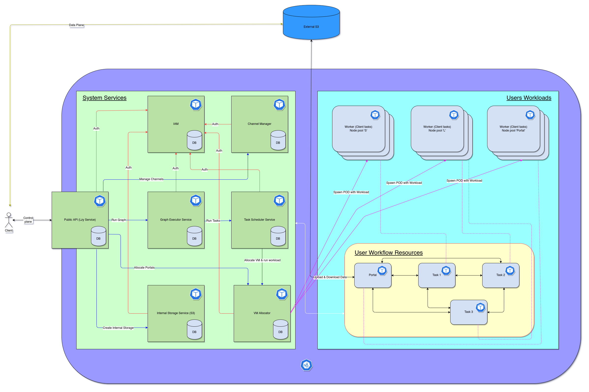
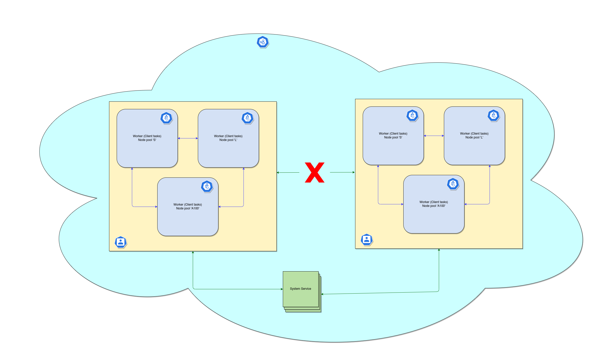

# Top-level description of the Lzy components

Lzy consists of system services (marked in green) and services executing user code (marked in blue).

Lzy is deployed in a Managed K8s cluster and uses the following features:
* Managed K8s Node Groups
* K8s Security Policy
* K8s Volumes
* NFS mounts

As a persistent storage Lzy uses Managed PostgreSQL.

(s)GRPC is used for communication between services.

## Lzy System Services

### Public Api (Lzy Service)
It is the entry point to Lzy. It manages:
* workflow lifetime;
* launch of new execution graphs (transform logical graph to physical one);
* tracking of execution status;
* receiving results (link to external storage).

### IAM (Identity and Access Management)
The service is responsible for managing the lifecycle of accounts and access to various resources.

**NB:** In an on-prem installation it's allowed to make integration with any IAM systems used in the company.

### Storage Service
Lzy client has the opportunity to either specify his own S3 storage for the results of intermediate calculations or
request such one from the system (with a help of the Storage Service).

In the first case the client should manage its lifetime and capacity itself.

In the second case, Lzy creates a temporary S3 bucket (with some restrictions on the lifetime and size) through the
`Storage` service. The calculation may be interrupted if the storage runs out of space.

### Graph Executor Service
This service is responsible for the execution of the physical graph. It receives a physical graph of operations from
`Lzy Service`, then transform it to the sequence of operation (or groups of linked operations) and execute
through `Scheduler Service`.

### Scheduler Service
This service receives physical operations (or connected groups of operations) and allocates VMs with corresponding
workloads.

### Channel Manager Service
The service manages data flows, connects data providers and consumers.

### VM Allocator Service
Through this service VMs are allocated for user calculations. This service interacts with Managed K8s clusters by
sending them allocation commands.

## Lzy user nodes
Lzy is a multi-tenant system based on K8s, which guarantees the isolation of tenants.

Isolation between tenants is provided by the following rules:
* A node (k8s node) after the end of the user operation can be reused for other computations of this user only.
Nodes are never shared between users.
* It is not allowed to run pods of different users on the same k8s node.
* K8s Security Policy is attached to all user nodes, which allow network connectivity only between the nodes of a single user.
* All nodes have access to system services, but only to their resources and with auth checks (at the beginning of the calculation, special roles are created in IAM).
